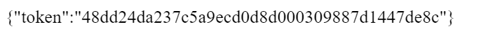
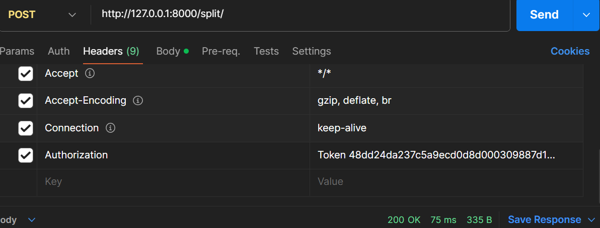
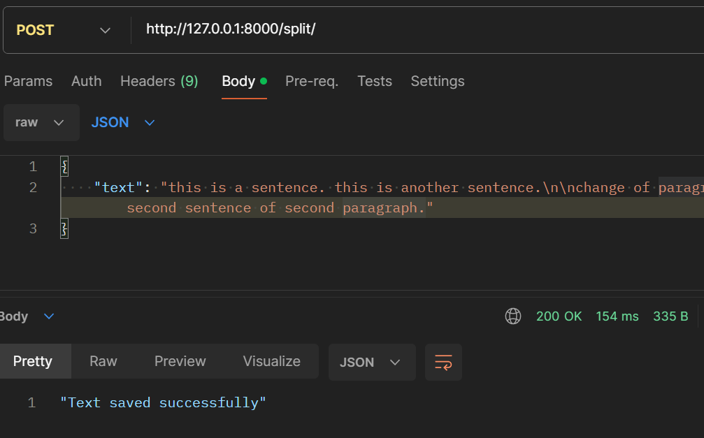
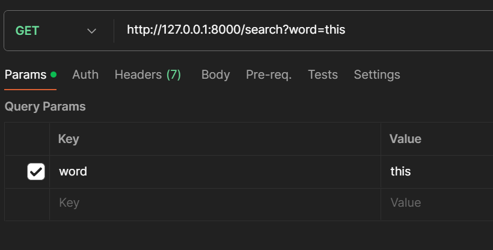
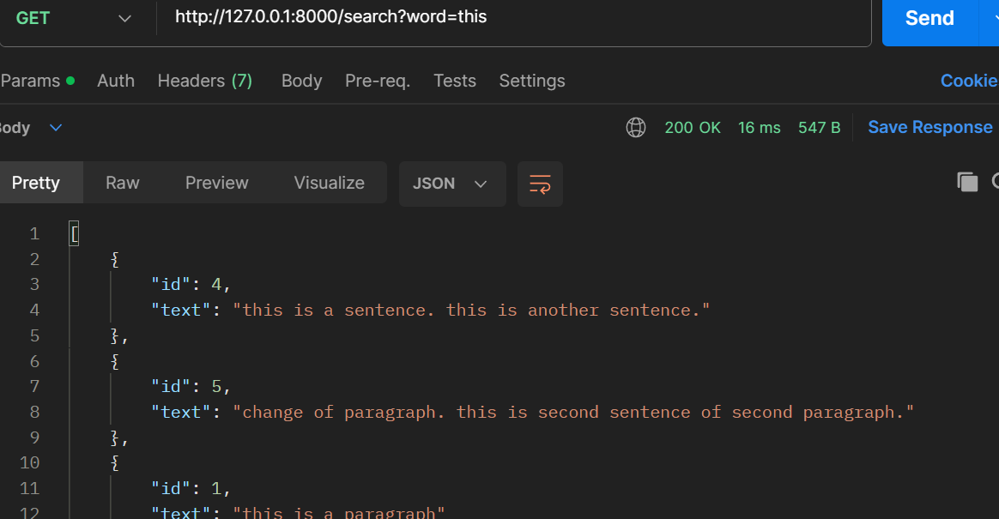

# Codemonk-api-backend
A Django and Django-rest-framework based backend API.

- takes in multiple paragraphs of text as input, stores each paragraph and the words to paragraph mappings in database
- allows searching for a given word to retrieve the top 10 paragraphs containing that word.


# Design Details

- The user model was extended from Django's AbstractUser class to create a custom user model. This model is defined in the models.py file. The custom user model includes fields such as name, email, date_of_birth, creation_date, and modify_date.

- The user registration process is handled by the RegisterView class in the views.py file. This class extends Django Rest Framework's APIView. The post method of this class handles the registration process, including data validation and user creation.

- User authentication is handled using Django Rest Framework's TokenAuthentication. Upon successful registration, a unique token is generated for the user. This token is used for authenticating subsequent requests from the user.

- Two models, Paragraph and Word, are defined in the models.py file. The Paragraph model is used to store the paragraphs, and the Word model is used to store the words in each paragraph. The Word model has a foreign key relationship with the Paragraph model, linking each word to its parent paragraph.

- The ParagraphSplitView class in the views.py file handles the functionality for storing paragraphs. It tokenizes the input text into paragraphs and words, and stores them in the database using the Paragraph and Word models.

- The WordSearchView class in the views.py file handles the functionality for searching for a word. It queries the database for paragraphs containing the target word, sorts them based on the word count, and returns the top 10 paragraphs.

- The ParagraphSerializer and WordSerializer classes in the serializers.py file handle the serialization of the Paragraph and Word models. These serializers are used in the views to convert model instances to JSON for the API responses.

- The ParagraphSplitView and WordSearchView classes require user authentication. The user must provide their authentication token in the request header to access these views.


# Project Structure
- api/ - This directory contains the main application logic.
- api/models.py - This file contains the data models for the application.
- api/serializers.py - This file contains the serializers for the data models.
- api/views.py - This file contains the views for the application.
- codemonk/settings.py - This file contains the settings for the Django project.
- codemonk/urls.py - This file contains the URL configurations for the project.
- manage.py - This is the command-line utility for administrative tasks.

# API Endpoints
- /split/ - This endpoint accepts a POST request with a text and splits it into paragraphs and words.
- /search/ - This endpoint accepts a GET request with a word and returns paragraphs containing that word, sorted by word count.
- /register/ - This endpoint accepts a POST request with user details (username, password, email, and optional date of birth) and registers a new user.

# Installation:

 - Set up venv and install required dependencies.
 ```bash
 cd codemonk
pip install -r requirements.txt
 ```

 - Run migrations
 ```shell
 python manage.py migrate
 ```
 - Start the Django server using the following command:
 ```shell
 python manage.py runserver
 ```

# Usage:

1. http://127.0.0.1:8000/register/

    Send a post request (using POSTMAN or curl) to the above url with these fields in the body as shown below:

    <screenshot>

    A token will be returned:

    <screenshot>

    You can use this token for further authentication.

2. http://127.0.0.1:8000/split/

    This is the endpoint for paragraph input.
    First, authenticate using the token as shown below:

    <screenshot>

    Then send post request as JSON as shown below:
    <screenshot>

3. http://127.0.0.1:8000/search/

    Endpoint to search for a word. First authenticate using token as above. Add search word as parameter in POSTMAN like this:

    <screenshot>

    The paragraph and its id will be output as shown below: (top 10 sorted by word count)
    

